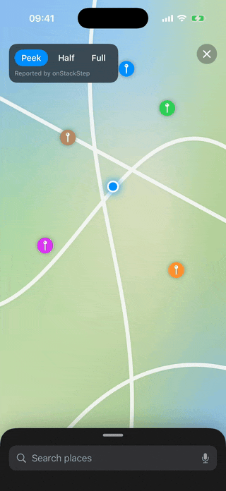
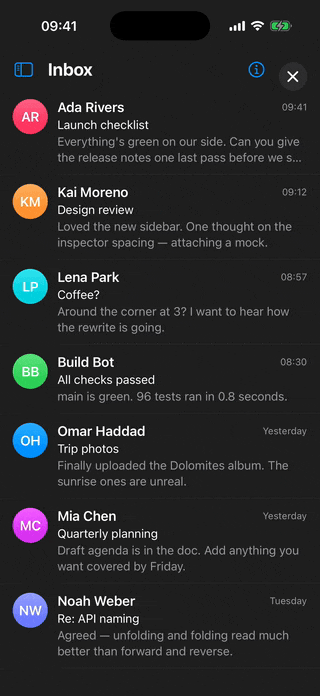
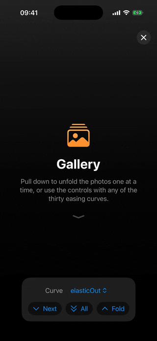
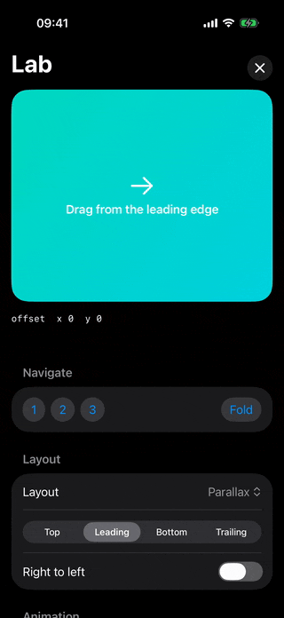

# SCEdgeStack

A SwiftUI container that stacks child views off the **top, leading, bottom and
trailing** edges of a root view, driving their frames and transforms from the
content offset of a hidden `UIScrollView`.

A superset of the sidebar and drawer patterns — pluggable layouts,
percentage-based navigation steps with directional blocking, thirty easing
curves for programmatic navigation, and occlusion-aware visibility reporting.
Not a `NavigationSplitView` clone.

| Sheet | Sidebars | Gallery | Lab |
|:-:|:-:|:-:|:-:|
|  |  |  |  |
| Detents are navigation steps, with a floor it never folds past. | Two edges, parallax, and a root that shrinks into a card. | Cards folding in 3D, unfolded along any easing curve. | Every layout, edge and curve, with the callbacks live. |

- iOS 18+, SwiftPM, Swift 6 language mode, zero dependencies.
- SwiftUI-only public API. The `UIScrollView` is an implementation detail and is
  never exposed.

## Install

```swift
.package(url: "https://github.com/stefanceriu/SCEdgeStack", from: "1.0.0")
```

## Use

```swift
StackReader { proxy in
    EdgeStack {
        MapView()
    } children: {
        MenuView()
            .stackEdge(.leading)
            .stackID(Panel.menu)

        TitleBar()
            .stackEdge(.top)
            .stackExtent(64)
            .stackNavigationSteps([.init(0.5)])   // half open, then all of it
    }
    .stackLayout(ParallaxStackLayout(), for: .leading)
    .stackPagingEnabled(true)
    .stackAnimation(.init(curve: .elasticOut, duration: 0.5))

    Button("Open") { Task { await proxy.reveal(Panel.menu) } }
}
```

Order within an edge is declaration order; index `0` sits adjacent to the root.

`.stackEdge(_:)` must come **first** in a child's modifier chain — it wraps the
view, so any other `.stack…` trait applied before it is swallowed. The `.stack…`
traits must also come **last**: any other modifier after them wraps the child
and hides them, and the child is laid out as a second, full-size root.

### Layouts

`PlainStackLayout`, `SlidingStackLayout`, `ParallaxStackLayout`,
`ResizingStackLayout`, `ReversedStackLayout` — or conform to `StackLayout`:

```swift
public protocol StackLayout: Sendable {
    func finalFrame(_ ctx: StackItemContext) -> CGRect
    func frame(_ ctx: StackItemContext, finalFrame: CGRect) -> CGRect
    func effect(_ ctx: StackItemContext, finalFrame: CGRect, visibleFraction: Double) -> StackEffect
    func rootFrame(_ ctx: StackRootContext) -> CGRect
    func rootEffect(_ ctx: StackRootContext, visibleFraction: Double) -> StackEffect
    var isReversed: Bool { get }
    var stacksAboveRoot: Bool { get }
}
```

Everything has a default, so a layout that only wants a transform overrides one
method. Frame and effect are separate because the effect needs
`visibleFraction`, which is computed *from* the frames.

### Navigation steps

A step is a fraction of a child's extent at which the stack stops. `0` and `1`
are always present. One drag advances one step; the next drag carries on:

```swift
.stackNavigationSteps([.init(0.25), .init(0.5)])   // quarter, half, all of it
```

A `block` is different — a hard limit, not a speed bump. It never releases, so
no amount of dragging gets past it. Use it for a floor or a ceiling:

```swift
.stackNavigationSteps([.init(0.1, block: .folding)])   // never fully hides
```

Programmatic navigation ignores blocks; `proxy.fold()` still folds.

### Reading visibility

Pull, through a stable observable object — so the environment never changes at
120 Hz and only views that read the fraction re-render:

```swift
@Environment(\.stackItem) private var item
Text(item?.visibleFraction.formatted() ?? "")
```

Push, through callbacks fired synchronously from the solve pass:
`.onStackOffsetChange`, `.onStackVisibilityChange`, `.onStackStep`.

`onAppear` and `onDisappear` keep SwiftUI's mount and unmount meaning and are
deliberately not hijacked.

### Programmatic navigation

```swift
await proxy.reveal(Panel.menu, to: .init(0.5))
await proxy.fold()
proxy.stopAnimation()
```

Adding a view to the `children` builder *is* the push; `reveal` is the unfold.
Cancelling the surrounding task stops the animation in flight.

Thirty easing curves ship as `StackEasing` statics, ported from `easing.c`.
`Animation.stackEasing(_:duration:)` makes them reusable for ordinary SwiftUI
state.

## How it works

A hidden `UIScrollView` is the physics and gesture engine. Its `contentSize`
always equals its `bounds.size`, so the entire scroll range *is* the
`contentInset` — which is what lets navigation steps gate a drag. Layout,
transforms and visibility are SwiftUI.

The whole SwiftUI subtree lives *inside* the scroll view, hosted by a
`UIHostingController`. That is what keeps hit-testing intact: an overlay scroll
view with no subviews has to swallow touches to receive pans, which kills every
`Button` in a child.

Placement happens entirely inside a `Layout`, so no child carries an
offset-dependent modifier. Per tick the cost is one pure solve over N children,
one `placeSubviews`, and one `Equatable` effect modifier per item whose effect
actually changed.

`Sources/StackGeometry` holds every solver and is platform-agnostic, so
`swift test` runs most of the suite on the host in about a tenth of a second
with no simulator.

## Known limits

- **One axis at a time.** Children on both the vertical and the horizontal axis
  make occlusion undefined; the engine logs an `os_log` fault. Nest two stacks
  instead.
- **`StackEffect` is a declarative subset of `CATransform3D`**, fixed at
  `scale . rotate . translate`. Shear, or a translation applied after the
  rotation, cannot be written directly — rotate the translation vector
  backwards instead.
- **Perspective differs from Core Animation.** `m34` is absolute, SwiftUI's
  `perspective` is relative to the view's extent; use
  `StackRotation3D.matchingM34(_:extent:)`.

## Demo

```
open SCEdgeStackDemo/SCEdgeStackDemo.xcodeproj
```

- **Sheet** — a Maps-style sheet whose detents are navigation steps, with a
  folding block as its floor and a root that dims and recedes behind it.
- **Sidebars** — a mail client with a parallax sidebar and an inspector on
  opposite edges; the inbox shrinks into a card and the rows follow their own
  visible fraction.
- **Gallery** — photo cards on one edge folding down in 3D, unfolded one by one
  with any of the thirty easing curves.
- **Lab** — every built-in layout on every edge, with the offset, visibility and
  step callbacks shown live.

## Tests

```
swift test                                                   # solvers, host only
xcodebuild test -scheme SCEdgeStack -destination 'platform=iOS Simulator,name=iPhone 17'
```

The solvers run on the host in about a tenth of a second.

## Licence

MIT. See `LICENSE`, and `NOTICE` for the WTFPL-licensed easing curves.
